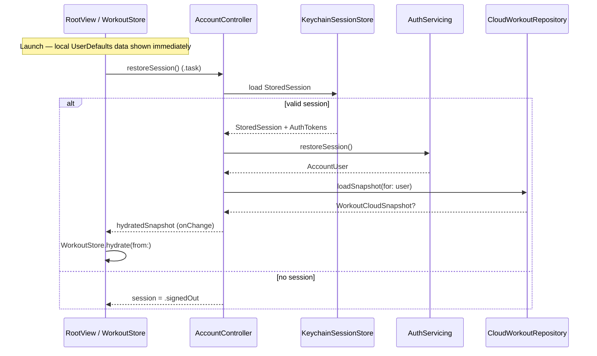

# ScratchWorkout Authentication Architecture

Decision and boundary reference for the account/auth module. Satisfies MAR-18 (provider choice), MAR-53 (module boundaries), MAR-19 (environment setup), and MAR-22 (session layer context).

---

## Overview

ScratchWorkout is building a functioning, SSO-ready, App Store–ready authentication infrastructure that lets users sign in with Apple or Google, sync workout plans and history to a remote backend, and delete their account on request — while keeping the core app fully usable offline with local `UserDefaults` persistence. The current milestone wires the session layer, secure storage, protocol seams, migration flow, and narrow app integration points; real Sign in with Apple / Google SDK calls and a live Supabase backend are deliberately deferred to follow-on tickets. When no backend URL is configured, the app runs in **local preview mode** (`LocalPreviewAuthService`, `LocalPreviewWorkoutRepository`) so every workout flow works without network or credentials.

---

## Provider decision (MAR-18)

**Decision: Supabase Auth + Postgres (Row Level Security)** as the target backend.

| Factor | Rationale |
|--------|-----------|
| Data model | Workout plans, logged sessions, and per-user snapshots map naturally to relational tables; SQL export supports GDPR/DSGVO data-access requests. |
| Isolation | Row Level Security enforces per-user data boundaries server-side, not only in client code. |
| SSO | Mature Apple and Google OAuth support; EU region hosting available for data residency. |
| Operations | Managed hosting with a self-host / local-dev path for contributors. |

**Runner-up: Firebase.** Fastest path to native Apple/Google SDKs and offline sync, but Firestore’s document model is a weaker fit for structured workout history and SQL-based export; vendor lock-in and query patterns for plan/history aggregation are less direct than Postgres + RLS.

This is a **starting decision**. Implementation tickets (MAR-19, MAR-26, and related) should update this section if the choice changes during integration.

---

## Module boundary map (MAR-53)

The account module lives under `ScratchWorkout/ScratchWorkout/` (`AccountModels.swift`, `AccountServices.swift`, `AccountView.swift`, plus session/storage/config types introduced in the auth hardening pass). The rest of the app integrates through **narrow adapters only** — workout logging, plan creation, and main navigation are **not** rewritten by auth.

### Account module owns

| Concern | Types / location |
|---------|------------------|
| Provider authorization | `AuthProviderAuthorizing` — obtains `AuthProviderCredential` from Apple/Google (stubbed until MAR-23 / Google ticket) |
| Session & token model | `AuthTokens`, `StoredSession`, `AccountUser`, `AuthSession` in `AccountModels.swift` |
| Secure session storage | `SessionStoring` protocol; `KeychainSessionStore` (`kSecClassGenericPassword`, `kSecAttrAccessibleAfterFirstThisDeviceOnly`); `InMemorySessionStore` for previews/tests |
| Backend session exchange | `AuthServicing` — `restoreSession()`, `signIn(with: AuthProviderCredential)`, `signOut()`, `deleteAccount(for:)` |
| Observable account state | `AccountController` — `session`, `syncState`, `hydratedSnapshot`, `authError`, `isWorking` |
| Remote workout persistence | `CloudWorkoutRepository` — load/save/delete `WorkoutCloudSnapshot` per user |
| Local → cloud migration | `AccountMigrating` / `RepositoryMigrationCoordinator` — prompt, upload, verify, idempotent retry |
| Sync status & write-through | `AccountSyncState`, `WorkoutSyncReason`; `AccountController.sync(snapshot:reason:)` |
| Sign-out & deletion | Sign-out clears session/tokens; delete removes remote data, auth profile, and provider revocation seam (Apple) |
| Configuration | `AuthConfig` — resolves backend base URL (see [Configuration & secrets](#configuration--secrets-mar-19)) |
| Errors | `AccountError` surfaced via `AccountController.authError` / `alertMessage` without blocking the UI |

### Existing app — integration points only

| Integration | Where | Contract |
|-------------|-------|----------|
| Launch & session restore | `RootView` | Owns `@StateObject AccountController`; calls `restoreSession()` in `.task` (non-blocking; local `WorkoutStore` loads immediately) |
| Hydration adapter | `RootView` | `.onChange(of: accountController.hydratedSnapshot)` → `WorkoutStore.hydrate(from:)` when remote snapshot arrives |
| Local snapshot source | `WorkoutStore` | `cloudSnapshot` builds `WorkoutCloudSnapshot` from local state for upload |
| Save / write-through events | `RootView.syncAccount(reason:)` | Fires on plan save (`planSaved`), plan update (`planUpdated`), workout completion (`workoutCompleted`); passes `store.cloudSnapshot` to `AccountController.sync` |
| Account UI entry | `HomeView` → sheet | `AccountEntryButton` + `AccountView(controller:currentSnapshot:)` |
| Xcode config | `ScratchWorkout/ScratchWorkout.entitlements`, `Info.plist` | `com.apple.developer.applesignin` entitlement; `AuthBackendBaseURL` key |
| Release / privacy | App Store metadata | Privacy policy, nutrition labels, Sign in with Apple capability on App ID (MAR-29) |

**Explicit non-goals for auth:** `WorkoutStore` persistence keys, tab navigation, plan creation wizard, workout logging views, exercise catalog, and stats — unchanged except for the hydration and sync hooks above.

---

## Session lifecycle & data flow

### Session states

`AuthSession` (`AccountModels.swift`):

| State | Meaning |
|-------|---------|
| `.loading` | Initial restore in progress; app remains usable with local data |
| `.signedOut` | No valid Keychain session; sync state `.signedOut` (“Local”) |
| `.signedIn(AccountUser)` | Authenticated; cloud sync available |

Errors map to `AccountError` and `AccountController.authError` / `alertMessage`. Failures downgrade to signed-out or failed sync state **without blocking** navigation or workout flows (MAR-50 performance guardrails).

### Sign-in

1. User taps provider in `AccountView` → `AuthProviderAuthorizing` returns `AuthProviderCredential`.
2. `AuthServicing.signIn(with:)` exchanges credential with backend (or preview stub); `KeychainSessionStore` persists `StoredSession` / `AuthTokens`.
3. `AccountController` loads remote `WorkoutCloudSnapshot`:
   - **Returning user (remote has data):** **remote wins** — hydrate `WorkoutStore` from cloud; never clobber existing cloud data with stale local state.
   - **New user, remote empty, local data exists:** `RepositoryMigrationCoordinator` prompts to upload local snapshot; user may accept or decline; upload is verified; operation is idempotent.
4. `syncState` → `.synced` on success; `.failed` with retry path on error.

### Sign-out

Clears Keychain session and tokens via `AuthServicing.signOut()`. Local `WorkoutStore` shell state is **preserved** — user keeps plans and history on device; sync label returns to “Local”.

### Delete account

`AccountController.deleteAccount()` → `CloudWorkoutRepository.deleteData`, `AuthServicing.deleteAccount`, provider token revocation (Apple, when wired). Session cleared; user remains in local-only mode.

### Ongoing sync

`RootView.syncAccount(reason:)` pushes `WorkoutCloudSnapshot` after meaningful local mutations. `AccountSyncState` reflects idle → syncing → synced / failed.

---

## Secure storage

| Data | Storage | Notes |
|------|---------|-------|
| `StoredSession`, `AuthTokens` | iOS Keychain (`KeychainSessionStore`) | `kSecClassGenericPassword`, `kSecAttrAccessibleAfterFirstThisDeviceOnly` |
| Workout app state | `UserDefaults` (`WorkoutStore`, key `scratchWorkout.appState.v2`) | Unchanged; not used for auth secrets |
| Preview auth (no backend URL) | `LocalPreviewAuthService` may use `UserDefaults` for dev-only preview sessions | Replaced by Keychain in production `AuthServicing` implementation |
| Service-role / admin keys | **Never in app binary or git** | Backend/server environment only |

No OAuth client secrets, Supabase service-role keys, or Apple private keys ship in the iOS target.

---

## Configuration & secrets (MAR-19)

`AuthConfig` resolves the backend base URL using the same precedence pattern as `ExerciseCatalogConfiguration.appDefault` in `ExerciseCatalog.swift`:

1. `UserDefaults` — `scratchWorkout.auth.backendBaseURL`
2. Process environment — `AUTH_BACKEND_BASE_URL`
3. `Info.plist` — `AuthBackendBaseURL`

First non-empty, non-placeholder value wins. **Empty / unset → local preview mode** (`LocalPreviewAuthService`, `LocalPreviewWorkoutRepository`); no network auth required.

### Maintainer setup (outside git)

Do not commit secrets. Configure per environment:

| Item | Where it lives |
|------|----------------|
| Supabase dev project | Supabase dashboard; note project URL + anon/publishable key |
| Supabase prod project | Separate project; EU region if required |
| iOS bundle ID | `com.marvinbeckmann.ScratchWorkout` (must match App ID) |
| Sign in with Apple | Apple Developer → App ID capability; Services ID; Sign in with Apple key (.p8); `ScratchWorkout/ScratchWorkout.entitlements` declares `com.apple.developer.applesignin` — **also enable on the App ID in the portal** |
| Google OAuth | Google Cloud Console — iOS OAuth client, consent screen, reversed client ID as URL scheme in Xcode |
| Publishable / anon key | May ship in app config or `Info.plist` for client-side Supabase SDK |
| Service-role key | **Server/backend env only** — never in repo, never in app |

### Checklist

- [ ] Create Supabase dev + prod projects; enable Auth providers (Apple, Google).
- [ ] Define Postgres schema + RLS policies (MAR-26).
- [ ] Set `AuthBackendBaseURL` in `Info.plist` for release builds (or scheme env var for local dev).
- [ ] Enable Sign in with Apple on App ID `com.marvinbeckmann.ScratchWorkout`; match entitlements file.
- [ ] Create Apple Sign in with Apple key and Services ID; store `.p8` in secure secret store.
- [ ] Create Google iOS OAuth client; add URL scheme to Xcode project.
- [ ] Store service-role key in backend/CI secrets only.
- [ ] Verify local preview mode still works with empty `AuthBackendBaseURL`.

---

## Testing seams

The auth layer is protocol-driven and mockable without real Apple/Google sessions or a live backend:

| Protocol | Mock / preview implementation |
|----------|-------------------------------|
| `AuthServicing` | `LocalPreviewAuthService` |
| `AuthProviderAuthorizing` | Test double returning canned `AuthProviderCredential` |
| `CloudWorkoutRepository` | `LocalPreviewWorkoutRepository` |
| `SessionStoring` | `InMemorySessionStore` |
| `AccountMigrating` | Stub coordinator with deterministic prompt/upload outcomes |

Inject dependencies via `AccountController(authService:providerAuthorizer:repository:migrationCoordinator:)` in tests and SwiftUI previews (and inject `SessionStoring` into `LocalPreviewAuthService(sessionStore:)`). `AccountView` and `RootView` previews already exercise signed-in / signed-out UI states.

---

## What is deferred (SSO later + release)

Remaining work is tracked in Linear; this document does not replace those tickets.

| Ticket | Scope |
|--------|-------|
| MAR-23 | Real Sign in with Apple (`AuthProviderAuthorizing` + ASAuthorizationController) |
| — | Real Google sign-in (GoogleSignIn SDK + `AuthProviderAuthorizing`) |
| MAR-19 / MAR-26 | Live Supabase backend, schema, RLS, and production `AuthServicing` / `CloudWorkoutRepository` |
| MAR-25 | Migration hardening + unit tests (`RepositoryMigrationCoordinator`, remote-wins rules) |
| MAR-28 | Account deletion backend path + provider revocation QA (especially Apple) |
| MAR-29 | Privacy policy + App Store privacy nutrition labels |
| MAR-30 | TestFlight QA matrix (sign-in, sync, migration, offline, delete) |

---

## Key source files

| File | Role |
|------|------|
| `ScratchWorkout/ScratchWorkout/AccountModels.swift` | `AccountUser`, `AuthSession`, `WorkoutCloudSnapshot`, `AccountSyncState` |
| `ScratchWorkout/ScratchWorkout/AccountServices.swift` | Protocols, `AccountController`, preview implementations |
| `ScratchWorkout/ScratchWorkout/AccountView.swift` | Sign-in, sync, sign-out, delete UI |
| `ScratchWorkout/ScratchWorkout/RootView.swift` | Session restore, hydration adapter, sync triggers |
| `ScratchWorkout/ScratchWorkout/WorkoutStore.swift` | Local persistence; `cloudSnapshot` / `hydrate(from:)` |
| `ScratchWorkout/ScratchWorkout/ExerciseCatalog.swift` | Config precedence pattern mirrored by `AuthConfig` |
| `ScratchWorkout/ScratchWorkout.entitlements` | Sign in with Apple capability |
