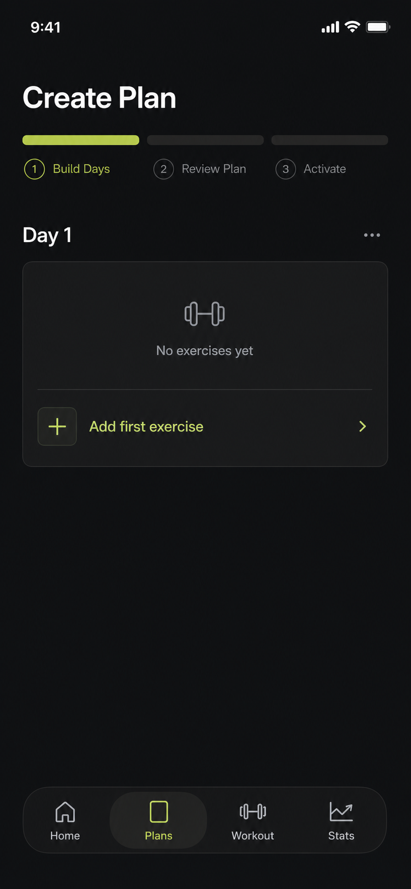
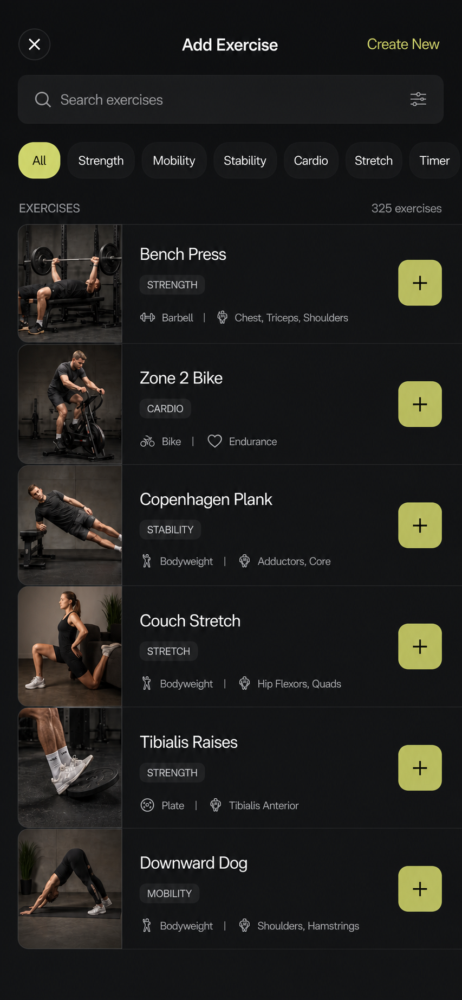
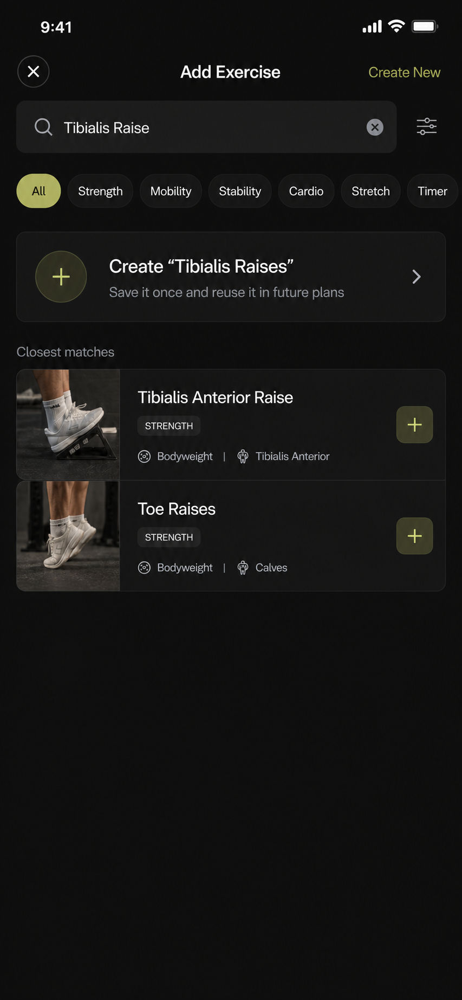
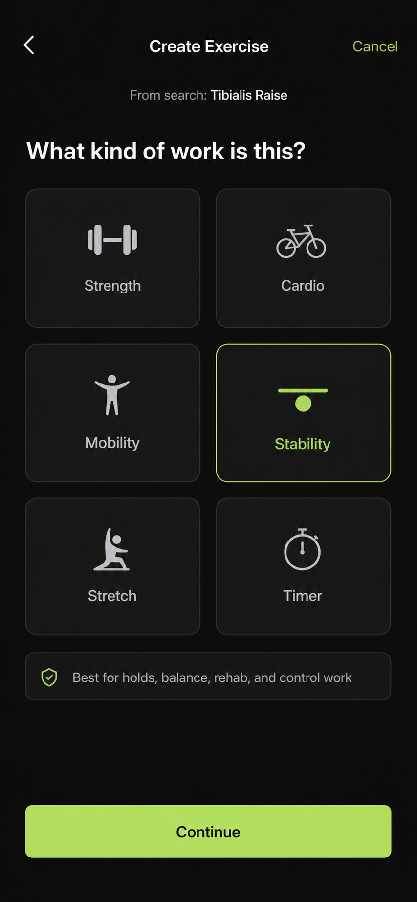
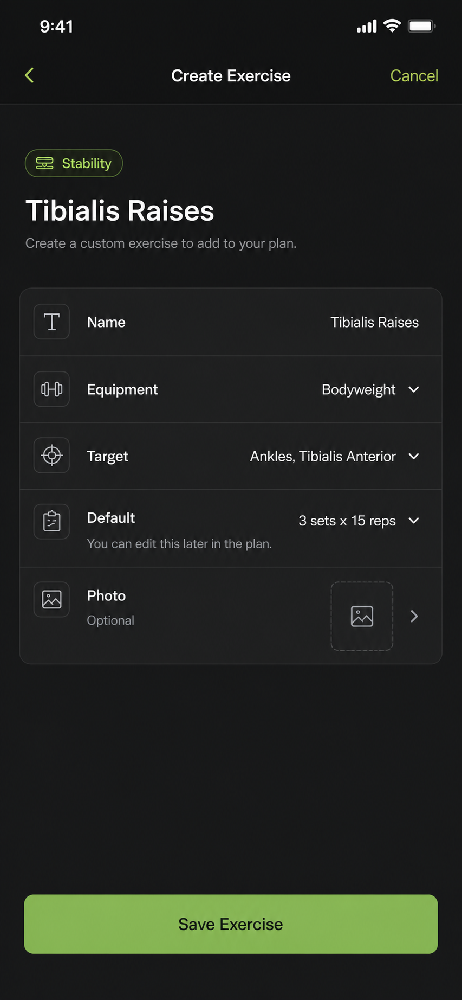
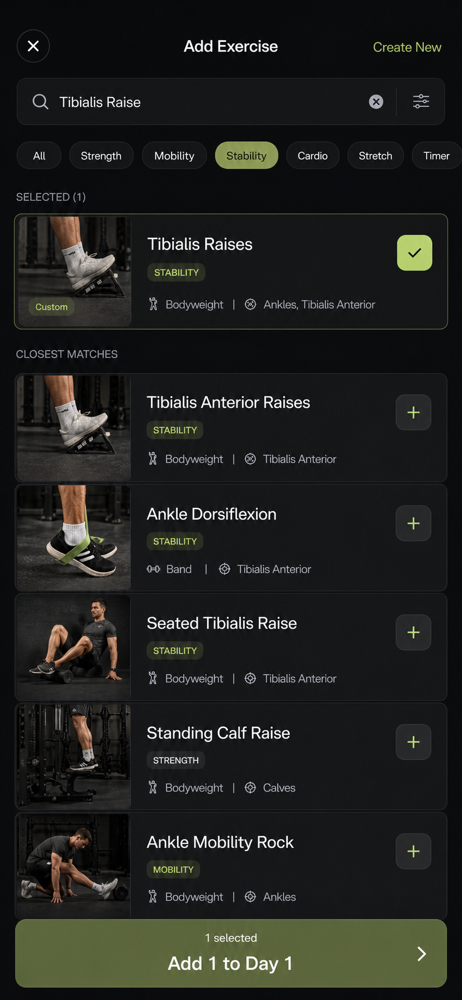
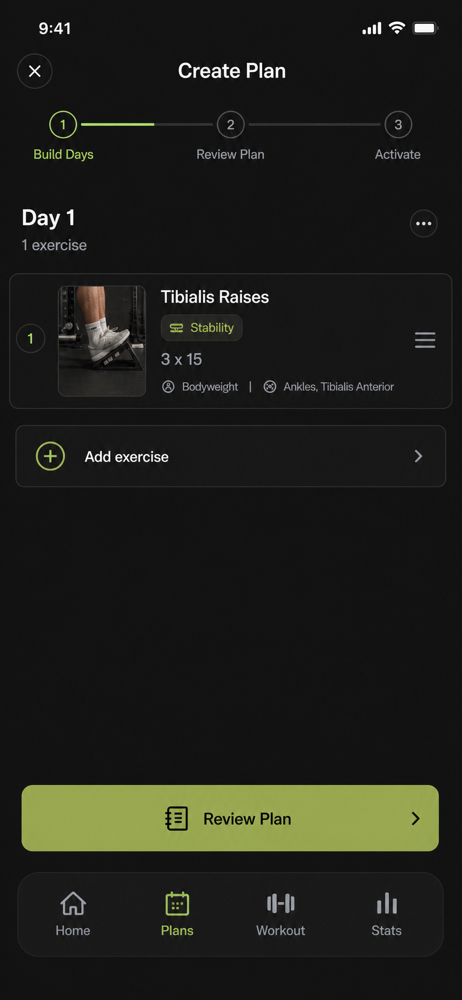

# MAR-58: Concept 1 + Concept 3 Journey Spec

Date: 2026-07-07

Linear issue: https://linear.app/marvinsprojects/issue/MAR-58/specify-concept-1-concept-3-integration-flow

## Concrete Recommendation

Use Concept 1 as the parent surface and Concept 3 as an embedded branch.

The user should never feel like they leave the add-exercise flow to create a custom exercise. The full-screen `Add Exercise` library owns search, selection, custom creation, and the return to the day composer.

The key interaction decision:

**Saving a custom exercise does not immediately dismiss the library.** It creates the exercise, selects it inside the library, and shows the bottom confirmation bar: `Add 1 to Day 1`.

Why this is better:

- It keeps custom creation compatible with future multi-select.
- It gives the user one last chance to add more exercises before returning.
- It prevents surprise navigation after save.
- It makes created custom exercises behave exactly like catalog exercises.

## Screen Set

### 1. Composer Entry



Purpose:

- Show the stable day composer before discovery starts.
- `Add first exercise` opens the full-screen library.

Requirements:

- The composer does not expand search inline.
- Empty state is quiet and task-oriented.
- Tapping the row creates an `AddExerciseSession` for `Day 1`.

### 2. Library Home



Purpose:

- Make exercise discovery a dedicated full-screen task.
- Show that the library supports mixed training, not only lifting.

Requirements:

- Pinned search field.
- Type filters: All, Strength, Mobility, Stability, Cardio, Stretch, Timer.
- Fixed-height rows with thumbnail, name, type, metadata, and add control.
- `Create New` remains available but is not the only custom-entry route.

### 3. No Exact Match With Create Row



Purpose:

- Convert a missing exercise into a next action.
- Avoid the current dead end: `No matching exercises`.

Requirements:

- If the normalized query has no exact catalog/custom match, show `Create "<normalized query>"` above partial matches.
- Partial matches remain useful but secondary.
- Do not show an oversized empty state when the user has already expressed a clear intent.

Create row display rule:

- Query has at least 3 non-space characters.
- Query is not an exact normalized match for an existing provider, bundled, or custom exercise.
- Create row title uses title-cased, plural-safe normalized query.

### 4. Custom Type Selection



Purpose:

- Give non-strength work equal legitimacy.
- Pick the prescription shape before asking for details.

Requirements:

- Stay inside the add-exercise context.
- Back returns to the search results with query preserved.
- Cancel exits custom creation and returns to the library, not the composer.
- Type options: Strength, Cardio, Mobility, Stability, Stretch, Timer.

Recommended default for `Tibialis Raises`:

- Type: Stability
- Rationale: it can be programmed as controlled lower-leg stability/rehab work while still supporting reps.

### 5. Custom Details Form



Purpose:

- Capture just enough structure to make the custom exercise reusable.

Required fields for this path:

- Name: `Tibialis Raises`
- Type: `Stability`
- Equipment: `Bodyweight`
- Target: `Ankles, Tibialis Anterior`
- Default prescription: `3 x 15`
- Optional photo/media

Rules:

- The default prescription can be edited later in the composer.
- Save validates name, type, and default prescription.
- Failed save stays on this screen with an inline error and preserves the draft.
- Duplicate custom names show an existing exercise row instead of creating another copy.

### 6. Saved And Selected In Library



Purpose:

- Confirm that custom creation succeeded without abruptly leaving the library.
- Make the new exercise behave like any selected catalog row.

Requirements:

- Created exercise appears in a `Selected` section.
- Row shows `Custom`, type, metadata, thumbnail/fallback, and selected checkmark.
- Bottom bar shows `1 selected` and `Add 1 to Day 1`.
- User can still add more exercises before confirming.

### 7. Composer Return



Purpose:

- Return the user to the stable day composer with the created exercise inserted as a normal editable row.

Requirements:

- The new item is added to the originating day only.
- Row shows name, type, prescription, metadata, thumbnail/fallback, and drag handle.
- `Add exercise` reopens the same library.
- `Review Plan` remains the next primary action.

## State Machine

```text
Composer(Day 1)
  -> AddExerciseLibrary(originDay: Day 1)
  -> Search(query: "Tibialis Raise")
  -> NoExactMatch(create row + close matches)
  -> CustomTypeSelection(query preserved)
  -> CustomDetailsForm(type: Stability)
  -> SaveCustomExercise
  -> LibrarySelection(selected: [custom:TibialisRaises])
  -> AddSelectedToDay
  -> Composer(Day 1, inserted item)
```

## Data Contract

### AddExerciseSession

- `originDayID`
- `query`
- `activeFilters`
- `selectedItemIDs`
- `createdItemID`
- `draftCustomExercise`

### Catalog Item

- `id`: stable provider, bundled, or custom ID
- `source`: provider | bundled | custom
- `name`
- `type`: strength | cardio | mobility | stability | stretch | timer
- `equipment`
- `target`
- `thumbnailURL` or fallback type icon
- `defaultPrescription`

### Custom Exercise Save

On save:

1. Normalize and validate name.
2. Check duplicate custom names.
3. Create stable custom ID.
4. Persist to personal exercise library.
5. Add created item to `selectedItemIDs`.
6. Return to library selection state.

## Exact, Partial, And No-Match Rules

### Exact Match

- Show exact provider/custom/bundled result first.
- `Create custom` can remain in the nav or below results, but not as the primary row.

### Partial Match

- If no exact normalized match exists, show `Create "<query>"` first.
- Show partial results below as `Closest matches`.

### No Match

- Show `Create "<query>"` first.
- Show a small explanatory line only if there are no close matches.
- Avoid a large empty-state illustration or final-sounding copy.

## Navigation Rules

- `X` on library with no selection: return to composer unchanged.
- `X` on library with selected items: ask whether to discard selected items.
- Back from type selection: return to no-match/search results with query preserved.
- Cancel from custom creation: return to library with query preserved and no created item.
- Save custom exercise: return to library selection state, not composer.
- Add selected to day: return to composer.

## Implementation Notes

- Do not embed search inside `PlanEntrySurface` for this flow.
- Add a shared full-screen library that can be launched from `CreatePlanView` and later `PlanDetailView`.
- Use stable identity for search rows:
  - provider ID for remote catalog rows
  - bundled ID for seed rows
  - custom ID for personal rows
- Do not create transient `ExercisePrescription` values with fresh UUIDs for search results.
- Convert selected catalog items into day prescriptions only when the user confirms `Add selected to Day`.

## Acceptance Criteria Updates For MAR-58

- Screen-by-screen journey is documented from composer entry through composer return.
- Concept 3 is specified as an in-library branch, not a separate destination.
- Save custom exercise selects the new item inside the library before returning to composer.
- Query, filters, selected items, and custom drafts have explicit preservation/cancel rules.
- Exact, partial, and no-match search behavior is specified.
- The generated screens are available under `screenshots/ux-concepts/07` through `13`.

