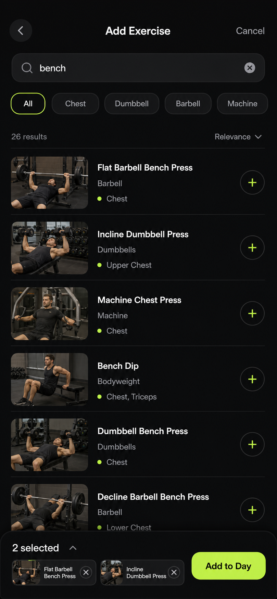
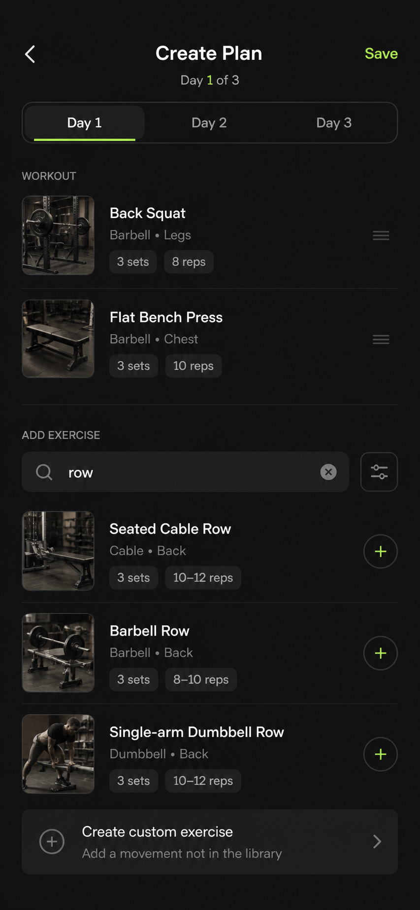
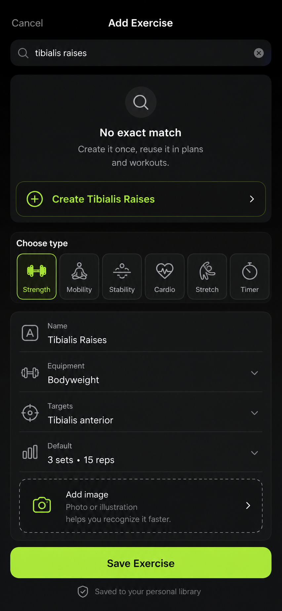
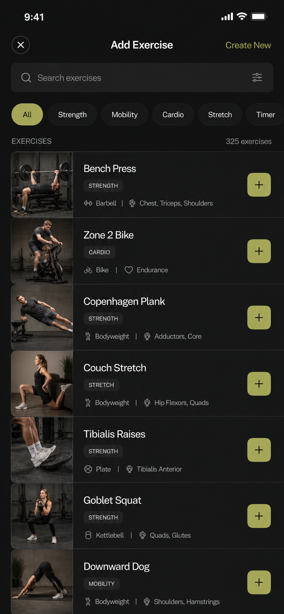
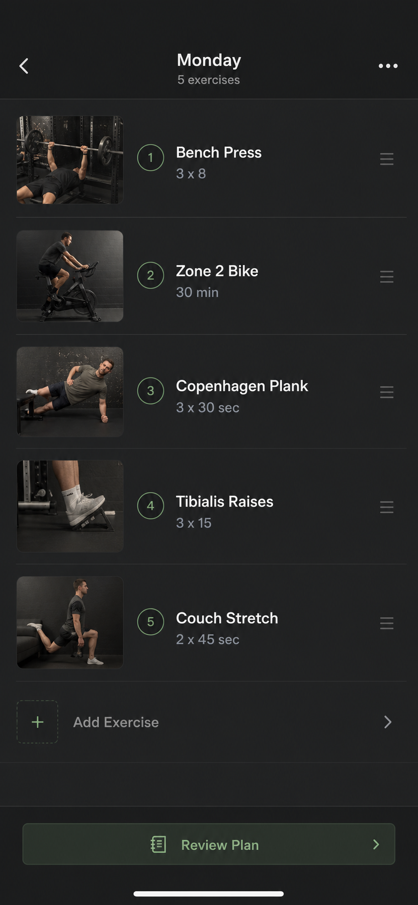
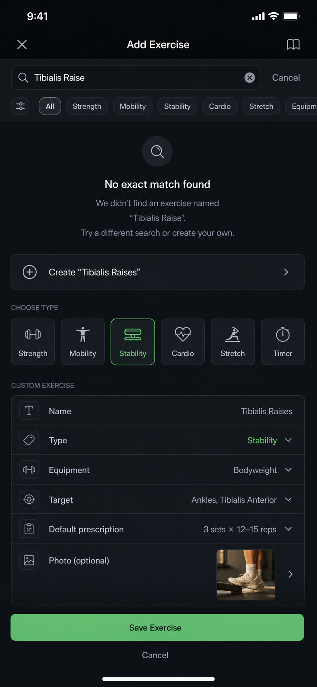

# ScratchWorkout Plan Creation UX Research

Date: 2026-07-07

## Brief

The real-world plan creation attempt failed because the app made exercise discovery too fragile: search moved around, common and niche exercises were hard to find, results lacked visual context, missing exercises dead-ended, and non-strength work such as bike riding, mobility, and tibialis raises had no obvious path.

The target is not to make ScratchWorkout more complex. The target is to make plan creation feel calmer, faster, and more forgiving while keeping the dark, plan-first Scratch identity.

## Evidence

### Current App Captures

- Overview: `screenshots/ux-research/00-overview-browser-mirror.png`
- Plans: `screenshots/ux-research/01-plans.png`
- Create Plan frequency: `screenshots/ux-research/02-create-frequency.png`
- Empty day: `screenshots/ux-research/03-empty-day.png`
- Empty search field: `screenshots/ux-research/04-search-empty.png`
- Bench search: `screenshots/ux-research/06-simulator-search-bench.png`
- Tibialis missing state: `screenshots/ux-research/07-simulator-search-tibialis-missing.png`

### Code Findings

- `CreatePlanView` is a progressive flow: frequency -> search/day building -> review -> activation. Preserve that shape.
- Search is currently an inline expanding `PlanEntrySurface` inside the day builder scroll view.
- The search card changes height as query/results change and is repeatedly scrolled into view on focus, result count, draft state, and search-surface visibility changes.
- Search rows likely get unstable identity because catalog results become `ExercisePrescription` values with fresh UUIDs.
- `ExercisePrescription` already has `thumbnailURL`, `imageURL`, `imageURLs`, and `videoURL`, so thumbnail-backed search is not blocked by the data model.

### Competitive / Reference Patterns

- Alpha Progression positions itself around plan generation, a curated exercise database, video/instructions, and custom exercises with images. Its App Store listing currently describes 795 exercises with videos and custom exercise images.
- Fitbod's custom exercise flow starts from search, then offers `Create New Exercise`; custom exercises can cover specialty movements, gym-specific machines, yoga, sprinting, martial arts, and other non-traditional work.
- Existing local Mobbin notes already support progressive setup, stable shell navigation, compact review moments, and list-first routine creation from Tempo, Equinox+, Runna, Hevy, Fitbod, Ladder, Nike Training Club, and Strava references.

Note: no live Mobbin MCP tool was exposed in this Codex session. This pass used the repo's `MOBBIN_RESEARCH.md`, live app captures, code inspection, and web/source research.

## Problem Synthesis

1. Search is doing too much inside too small a component.
   The current inline card has to be a text field, result list, loading state, missing state, provider attribution, and scroll target. That makes the whole page feel unstable.

2. Missing results are treated as the end of the task.
   Searching `tibialis raises` shows `No matching exercises`, but the user's next need is obvious: create that movement and keep building the plan.

3. Text-only results make exercise choice unnecessarily cognitive.
   Many exercise names are ambiguous unless the user already knows the movement. Thumbnails can answer "is this the thing I mean?" faster than metadata.

4. The catalog boundary is too strength-biased.
   A real plan can include stability, mobility, warm-up, cardio, Zone 2, and rehab-like exercises. These should be first-class loggable units.

5. The visual system is strong but tiring in long setup flows.
   Scratch's black/white/neon contrast works for athletic focus, but plan creation needs more gray hierarchy, softer row separation, and less green.

## Recommended Product Direction

### Primary Recommendation

Pivot directly to concept 1: a full-screen `Add Exercise` library launched from the plan composer.

The composer still matters, but it should not own the search interaction. When the user taps `Add first exercise` or `Add exercise`, move them into a stable add-exercise surface where search, filters, thumbnails, custom creation, and non-strength types have enough room to work well.

The library should include:

- pinned search field
- fixed-height visual rows
- thumbnails
- exercise metadata: equipment, target, and type
- type filters: All, Strength, Mobility, Stability, Cardio, Stretch, Timer
- muscle/equipment filters
- recent and popular sorting
- explicit custom-exercise row
- optional multi-select so users can add several exercises to one day quickly

Then the user returns to the plan composer with selected exercises inserted into the current day. The composer becomes the stable review/configuration shell; the library becomes the discovery surface.

This is the most user-friendly pivot because it attacks the deepest problem: the user could not confidently find or create the things in their plan. A small inline search can be made less jumpy, but it will still be a cramped place to solve discovery, thumbnails, filters, custom movements, and mixed training types.

### Missing Exercise Recovery

For no exact match, show a create path immediately:

- `Create "Tibialis Raises"`
- type presets: Strength, Mobility, Stability, Cardio, Stretch, Timer
- fields: name, equipment, target, default prescription
- optional image/photo/source exercise

This turns unknown exercises from a blocker into a quick detour.

### Expanded Exercise Universe

Problem 4 requires a product-model change, not only a prettier search UI.

ScratchWorkout should treat these as valid plan items:

- Strength: sets, reps, optional weight
- Cardio: duration, distance, zone, optional notes
- Mobility: duration or reps, target area
- Stability: duration or reps, target area
- Stretch: duration, side, target area
- Timer: duration, label, optional rounds

Examples that should be addable without workarounds:

- Bike Riding
- Zone 2 Bike
- Tibialis Raises
- Copenhagen Plank
- Couch Stretch
- Warm-up Walk
- Shoulder CARs

The exercise library should expose these via type filters and custom-exercise presets. This makes ScratchWorkout a real workout planner rather than a lifting-only list.

### Exercise Rows

Search rows should include:

- 56-72pt thumbnail
- exercise name
- equipment
- primary target
- optional type label, such as Strength, Mobility, Cardio
- add button or selected state

Rows should use stable IDs from provider exercise ID or normalized custom exercise ID, not fresh UUIDs.

### Motion Rules

- The shell should not move while typing.
- Result updates should crossfade or replace rows without changing the scroll position.
- Avoid auto-scroll on every result count or focus change.
- Reserve animation for clear state changes: selecting a row, saving a custom exercise, returning to the day.

### Visual Tone

Problem 5 needs visual treatment, not just copy polish. Keep Scratch dark and athletic, but soften plan creation:

- more charcoal and muted gray hierarchy
- green only for selected filters, selected rows, and primary actions
- fewer bordered cards, more grouped rows with separators
- stable row heights
- thumbnails that bring warmth and recognition
- smaller, calmer headings inside dense planning surfaces
- less pure white body text; use off-white for primary rows and muted gray for metadata
- use green as a signal, not decoration
- no animated search-panel expansion while typing

The goal is Alpha Progression's feeling of a trustworthy shell, not Alpha Progression's exact skin.

## Concepts

### 1. Full-Screen Exercise Library

Best for: the main add-exercise interaction and the direct pivot from the current UX.

Why it works:

- Search becomes the page, not a small expanding panel.
- Results are visual and scannable.
- Filters and sort can exist without crowding.
- Multi-select lets users build a day quickly.
- Type filters can make cardio, mobility, stability, stretch, and timer work first-class.
- The calmer, media-rich surface directly addresses the current visual harshness.

Tradeoff:

- It is a bigger navigation change than patching the inline card, but it is the correct user-facing change.

### 2. Plan Composer With Visual Search

Best for: preserving more of the current inline builder while making it calmer.

Why it works:

- Day structure remains visible.
- Existing exercises and search results share one stable list language.
- A custom row is always nearby.

Tradeoff:

- Still risks crowding on smaller phones if the keyboard is open. This is why it should become the composer return state, not the primary search surface.

### 3. Custom Exercise Recovery

Best for: missing-library recovery and support for mobility/cardio/stability.

Why it works:

- No-match is no longer a dead end.
- Type presets make non-strength work feel legitimate.
- The user can create once and reuse forever.

Tradeoff:

- Requires a persistent personal exercise library model, not just one-off plan text.

### Problem 5 Visual Direction Concepts

These imagegen concepts make the calmer visual direction concrete.

#### Warm Charcoal Library

Best for: the main library surface.

Why it works:

- Keeps the dark athletic identity but reduces harsh black/white contrast.
- Uses thumbnails and fixed rows to make search feel stable and recognizable.
- Makes green a selection/action signal rather than decoration.

#### Training Notebook Composer

Best for: the composer return state after selecting exercises from the library.

Why it works:

- Shows exactly how Concept 2 should survive: as a stable day review surface, not as the main search UI.
- Mixes strength, cardio, stability, and stretch items in one scannable list.
- Keeps the `Add Exercise` entry point quiet but obvious.

#### Quiet Pro Custom Recovery

Best for: the Concept 3 no-match recovery embedded inside Concept 1.

Why it works:

- Turns a missing search result into the next useful action.
- Gives non-strength types equal status through type presets.
- Shows how a compact custom exercise form can live inside the Add Exercise context without feeling like a separate workflow.

### MAR-58 Concept 1 + Concept 3 Journey

Full spec: `MAR-58_CONCEPT_1_3_JOURNEY_SPEC.md`

The concrete recommendation is to keep custom exercise creation inside the full-screen `Add Exercise` library. Saving a custom exercise creates it, selects it in the library, and shows `Add 1 to Day 1`; it does not immediately dismiss back to the composer.

Journey screens:

- Composer entry: `screenshots/ux-concepts/07-mar58-composer-entry.png`
- Library home: `screenshots/ux-concepts/08-mar58-library-home.png`
- No exact match with create row: `screenshots/ux-concepts/09-mar58-no-exact-match-create-row.png`
- Custom type selection: `screenshots/ux-concepts/10-mar58-custom-type-selection.png`
- Custom details form: `screenshots/ux-concepts/11-mar58-custom-details-form.png`
- Saved and selected in library: `screenshots/ux-concepts/12-mar58-saved-selected-library.png`
- Composer return: `screenshots/ux-concepts/13-mar58-composer-return-v2.png`

## Implementation Sequence

1. Build the full-screen `Add Exercise` library.
   Launch it from `Add first exercise` / `Add exercise`, keep a pinned search field, use stable rows, show thumbnails, and return selected items to the active day.

2. Stabilize search result identity.
   Use stable row identity based on provider exercise ID or normalized name. Stop generating fresh IDs for transient search rows.

3. Add visual exercise rows.
   Use existing thumbnail/image URL fields with a fallback icon or generated local placeholder for seed/custom items.

4. Add exercise types and filters.
   Add Strength, Mobility, Stability, Cardio, Stretch, and Timer as first-class type concepts in the library and custom exercise flow.

5. Add custom exercise creation from search.
   Start with local persistence and minimal fields: name, type, equipment, target, default sets/reps or duration.

6. Add cardio/mobility logging fields.
   Strength uses sets/reps/weight. Cardio uses duration/distance/zone. Mobility/stretch/timer use duration or reps.

7. Polish plan creation tone.
   Reduce neon exposure, soften row surfaces, and keep motion quiet.

## Decision

Implement concept 1 first, with concept 3 embedded as the missing-exercise recovery path.

Why:

- It is the most user-friendly answer to the actual failure: the user needed to find, recognize, and add exercises fast.
- It gives thumbnails, filters, custom creation, and mixed exercise types enough room.
- It prevents the search UI from resizing and auto-scrolling the day composer while the user is typing.
- It directly addresses Problem 4 by making non-strength exercise types first-class.
- It directly addresses Problem 5 by giving plan creation a calmer, media-rich visual surface.

Concept 2 should still inform the return state: after adding exercises, the day composer should show a stable list with thumbnails, prescriptions, and a clear `Add exercise` entry point. But search itself should pivot to Concept 1.
